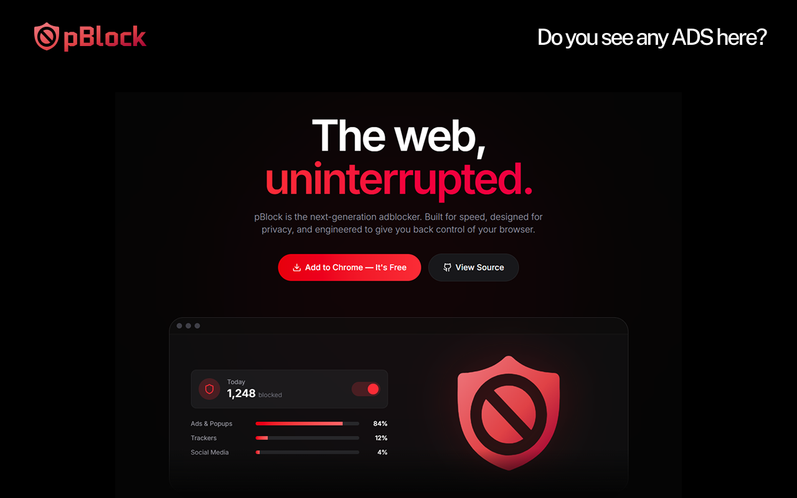
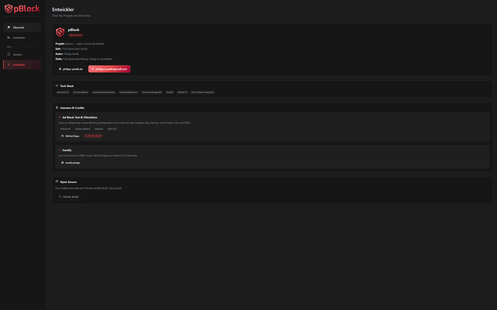
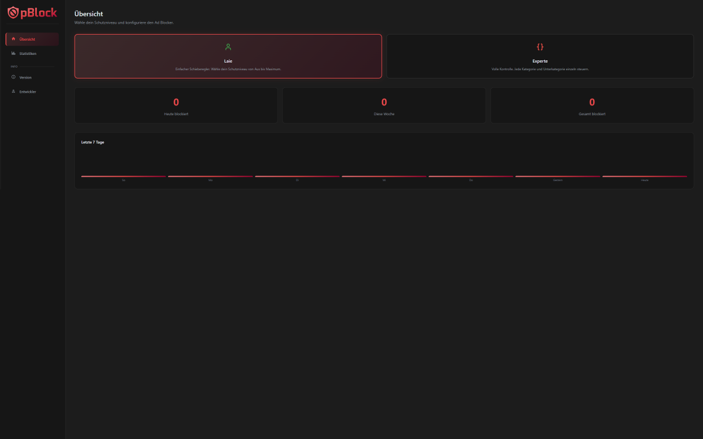
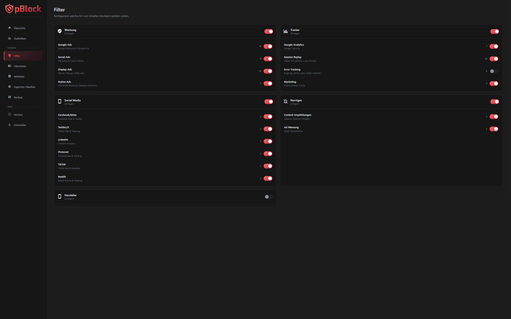

<p align="center">
  
</p>

<p align="center">
  <strong>Open Source Ad Blocker for Chrome</strong><br>
  Block ads, trackers, and social media with a 3-level filter system
</p>

<p align="center">
  
  
  
  
</p>

---

## Features

- **3-Level Filter System** — Simple mode with slider (Off to Max) or Expert mode with granular category control
- **Element Picker** — Click any element on a page to block it permanently
- **Cosmetic Filters** — Hide ad containers and banners via CSS injection
- **Per-Site Statistics** — Track blocked requests per domain
- **Filter Presets** — EasyList, EasyPrivacy, AdGuard Base, Peter Lowe's, URLhaus Malware
- **Whitelist Management** — Exclude trusted sites from blocking
- **Real-time Stats** — Live counter with animated badge updates
- **Export/Import** — Backup and restore your settings as JSON
- **100% Local** — No data leaves your device, no remote code

## Screenshots

<p align="center">
  
  
</p>

<p align="center">
  
  
</p>

## Installation

### From Chrome Web Store

*Coming soon...*

### Manual Installation (Developer Mode)

1. Clone this repository:
   ```bash
   git clone https://github.com/philppplik/pBlock.git
   ```
2. Open Chrome and go to `chrome://extensions/`
3. Enable **Developer mode** (top right toggle)
4. Click **Load unpacked** and select the cloned folder

## Filter Categories

| Category | Description | Examples |
|----------|-------------|----------|
| **Ads** | Display ads, popups, video ads | Google Ads, Taboola, Outbrain |
| **Trackers** | Analytics & tracking scripts | Google Analytics, Hotjar, Mixpanel |
| **Social** | Social media widgets & buttons | Facebook Pixel, Twitter, LinkedIn |
| **Annoyances** | Cookie banners, ad overlays | Content recommendation, ad measurement |
| **OEM** | Manufacturer tracking | Samsung, Xiaomi, Huawei, Apple |

## Protection Levels

| Level | Slider | Description |
|-------|--------|-------------|
| Off | 0% | No blocking |
| Minimal | 25% | Only ads |
| Standard | 50% | Ads + trackers |
| High | 75% | Ads + trackers + social |
| Maximum | 100% | All categories enabled |

## Privacy

pBlock collects **zero user data**. All processing happens locally on your device.

- No personal data collected
- No browsing history tracked
- No data sent to external servers
- No remote code loaded
- All filter lists bundled locally

Read the full [Privacy Policy](privacy.html).

## Tech Stack

- **Manifest V3** — Chrome Extension standard
- **Service Worker** — Background processing
- **declarativeNetRequest** — MV3-compliant network blocking
- **MutationObserver** — Dynamic DOM content monitoring
- **Chrome Storage API** — Local settings & statistics
- **Iconify** — Icon system (MDI preset, bundled locally)

## Development

### Project Structure

```
pBlock/
├── manifest.json          # Extension manifest (MV3)
├── background.js          # Service worker
├── popup.html / .js       # Extension popup UI
├── options.html / .js     # Settings page
├── privacy.html           # Privacy policy
├── wizard.html / .js      # First-run setup wizard
├── css/
│   └── common.css         # Shared styles
├── js/
│   ├── storage.js         # Storage manager
│   ├── rules.js           # Filter rule engine
│   ├── statistics.js      # Stats tracking
│   ├── cosmetic-filter.js # CSS hide rules
│   ├── cosmetic-injector.js # Content script
│   ├── element-picker.js  # Visual element picker
│   ├── presets.js         # Filter list manager
│   ├── site-stats.js      # Per-site statistics
│   ├── notifications.js   # Notification system
│   └── vendor/
│       └── iconify-icon.min.js
├── icons/                 # Extension icons
└── images/                # Logos & screenshots
```

## Credits

- **[Toolz/d3Host](https://github.com/Turtlecute33/toolz)** — Host lists for ads, analytics, social trackers (CC BY-NC-SA 4.0)
- **[Iconify](https://iconify.design/)** — Icon framework (MIT)

## License

MIT License — see [LICENSE](LICENSE) for details.

## Developer

**Philipp Paulik**
- Website: [philipp-paulik.de](https://philipp-paulik.de)
- Email: philipp.l.paulik@gmail.com

---

<p align="center">
  Made with ❤️ in Germany
</p>
